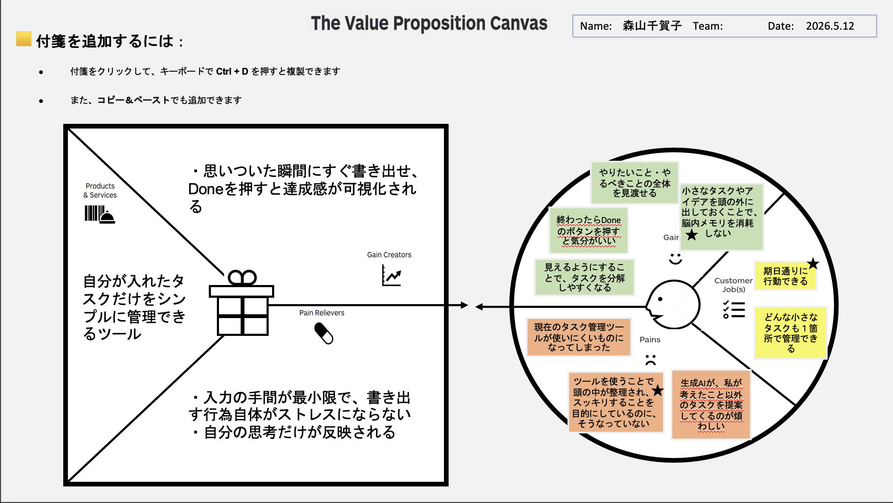

# VPC v1 - chica_75969

> 「**自分や周りの人を顧客に設定**」したVPC。13週後の自分が欲しいもの・身近な人のために作りたいものを設計する。
> v1 でいい。完璧を目指さない。第6回でアップデート(v2)します。

---

## 1. 解決したい困りごとを 1つ 選ぶ

> [`bug-list.md`](./bug-list.md) の20個から、**「自分が一番これを解決したい!」と思うもの** を1つ選んでください。
> 1つに絞れなければ、複数候補を書いてOK(後で絞り込みます)。

**選んだ困りごと**:

1. Podcast収録関連の作業がオーガナイズされていなくて、気づくと在庫がなくなっている。
4. やりたいことが1日や1週間や、1ヶ月の中で全部できるのかを見通すツール
9. 今やるべきタスクがどれだけあるのかを管理し、一瞬で登録、済のチェックをできる、iPhoneでも使えるアプリケーション。
11. 毎月、毎週、毎月の自分のタスクの見通しが立ち、達成へのテンションを維持できるツール
13. 毎日やりたいことが全部終わらない
16. サブスクリプションの解約し忘れ
17. 意思決定したいこととまだ迷ったり調べたりしたいことの区別がないために、脳のメモリを食ってしまっている。
18. 返信しなければならない問い合わせやメールのことで脳のメモリを食ってしまっている。

---

## 2. その解決策のアイデアを書く

> 選んだ困りごとに対する「**こうだったらいいのに**」を1つ書く。
> 現実性は気にせず、自由に発想。

**解決のアイデア**:

自分が入力したタスクだけをシンプルに管理できるツール

---

## 3. VPC本体

> 上で選んだ「困りごと」と「解決のアイデア」を起点に、6要素を埋めていきます。

### 🟦 Customer Profile(顧客=自分自身)

#### Jobs(やりたいこと・動詞で書く)

- どんな小さなタスクも1箇所で管理できる
- 期日通りに行動できる

#### Pains(困っていること)

- 現在のタスク管理ツールが使いにくいものになってしまった
- 生成AIが、私が考えたこと以外のタスクを提案してくるのが煩わしい
- ツールを使うことで頭の中が整理され、スッキリすることを目的にしているのに、そうなっていない

#### Gains(得たい未来・状態)

- 小さなタスクやアイデアを頭の外に出しておくことで、脳内メモリを消耗しない
- やりたいこと・やるべきことの全体を見渡せる
- 終わったらDoneのボタンを押すと気分がいい
- 見えるようにすることで、タスクを分解しやすくなる

---

### 🟧 Value Map(あなたが作るもの)

#### Products & Services

- 自分が入力したタスクだけをシンプルに管理できるツール

#### Pain Relievers

- 入力の手間が最小限で、書き出す行為自体がストレスにならない
- 自分の思考だけが反映される

#### Gain Creators

- 思いついた瞬間にすぐ書き出せ、Doneを押すと達成感が可視化される

---

## 4. Fit確認(整合チェック)

| Pains/Gains | ↔ | Pain Relievers / Gain Creators | チェック |
|---|---|---|---|
| 生成AIが、私が考えたこと以外のタスクを提案してくるのが煩わしい | ↔ | 自分の思考だけが反映される | ✓ |
| ツールを使うことで頭の中が整理され、スッキリすることを目的にしているのに、そうなっていない | ↔ | 入力の手間が最小限で、書き出す行為自体がストレスにならない | ✓ |
| 小さなタスクやアイデアを頭の外に出しておくことで、脳内メモリを消耗しない | ↔ | 思いついた瞬間にすぐ書き出せ、Doneを押すと達成感が可視化される | ✓ |

> 整合しないものは「自分が作りたいだけ」のプロダクトになりがち。
> 迷ったら AI大学講師に壁打ち。
